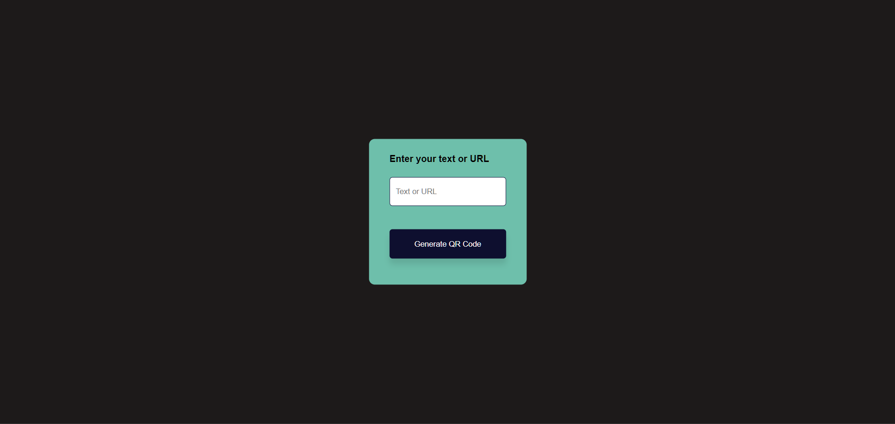

# 🔳 QR Code Generator
### 📌 Overview

The **QR Code Generator** is a simple and responsive web application that generates QR codes dynamically based on user input (text or URL). Built using** HTML, CSS, and JavaScript** the project leverages the QRCode.js library to create QR codes instantly with a smooth and modern UI experience.

### ✨ Features

- 📝 Input field to enter text or a URL

- 🔘 Button to generate QR codes

- 🎞️ Smooth transition effect when displaying the QR code

- 📱 Fully responsive and modern design

- ⚠️ Error handling with shake animation for invalid or empty input

### 🛠️ Technologies Used

- HTML5 – Structure of the application

- CSS3 – Styling, animations, and responsive layout

- JavaScript – QR code generation logic

### 📂 Project Files
   QR-Code-Generator/\
   │\
   ├── index.html\               
   └── style.css      

### ⚙️ Setup & Installation
**1️⃣ Clone or Download the Project**

  - Download the ZIP file or clone the repository to your local machine.

**2️⃣ File Structure**

  - Ensure the following files are in the same directory:

    - index.html

    - style.css

  - The QRCode.js library is included via CDN, so no local installation is required.

**3️⃣ Run the Application**

  - Open index.html in any modern web browser (Chrome, Firefox, Edge).

  - No server or backend setup is required.
    
### 📦 Dependencies

  - 🌐 Internet connection (required to load QRCode.js via CDN):

        https://cdnjs.cloudflare.com/ajax/libs/qrcodejs/1.0.0/qrcode.min.js
    
### ▶️ Usage

  - Open the application in a web browser

  - Enter a valid text or URL

  - Click the Generate QR Code button

  - The generated QR code appears with a smooth transition

  - If input is empty or invalid, a shake animation indicates an error

### 🎨 Styling & UI Details

  - Uses Poppins font for a clean, modern look

  - Centered container with a green background (#6ebfab)

  - Rounded corners and smooth transitions

  - QR code displayed in a styled box

  - Shake animation applied for error feedback

### 🔧 Customization

You can easily extend or customize this project:

 - 🎨 Modify style.css to change colors, fonts, or layout

 - 📐 Adjust container width or padding for different screen sizes

 - 🎞️ Customize transition duration or animation keyframes

 - ⬇️ Enhance script.js to:

    - Download the generated QR code

    - Validate specific URL formats

    - Add dark/light mode
  
### 📄 License

This project is **open-source** and available under the **MIT License**.

### 👨‍💻 Author

**A.S.M. Sium**\
Frontend Developer & Photographer

### 🎥 Preview

